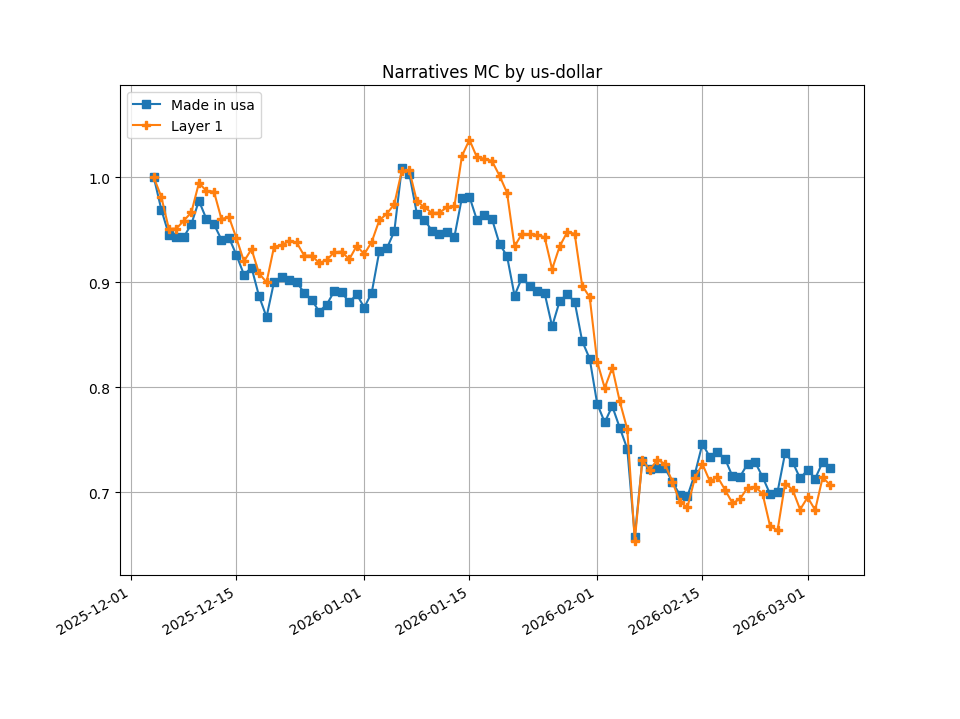
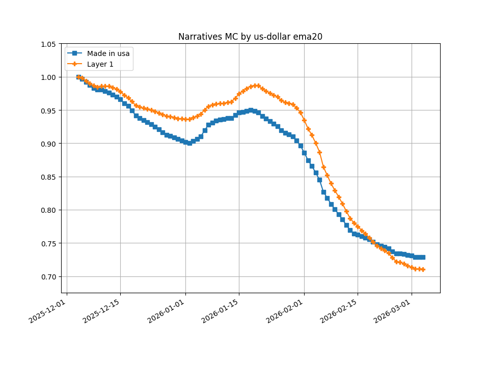
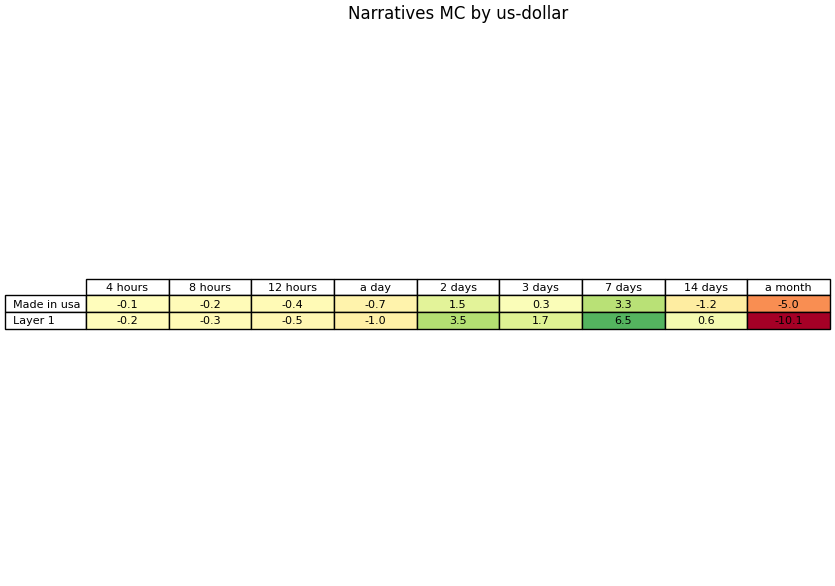

<!-- docs:start -->
# MarketFlows

[](https://github.com/elliottbache/marketflows/actions/workflows/ci.yaml)
[](https://codecov.io/github/elliottbache/marketflows)
[](https://github.com/elliottbache/marketflows/releases)
[](https://github.com/elliottbache/marketflows/blob/main/LICENSE)

Track capital-flow and narrative rotation across markets.

MarketFlows is a config-driven CLI that:
- fetches market-cap history from a provider (MVP: CoinGecko),
- aggregates by narratives / portfolios / market-cap ranges,
- outputs charts and percent-gain tables as PNGs (a short report is planned later).

## Samples




## Quickstart
### Download repo
In an Ubuntu/WSL terminal:
```bash
sudo apt install -y git
git clone https://github.com/elliottbache/marketflows.git
cd marketflows
```

### Configure

1) Create `secrets.toml` (see [Secrets](#secrets))
2) Edit `config.toml` (see [Configuration](#configuration))

### Quickstart (recommended): Local (Ubuntu/WSL)
In an Ubuntu/WSL terminal:
```bash
make deps
make setup
make run
```
Note: this program makes multiple HTTP calls per run. If you request narratives + ranges, it can take a while due to rate limits.

That's it, you’ve run MarketFlows end-to-end!  You can now check the resulting plots in ``output_plots``.

### Tutorial mode (offline)
Optional: compare your log and graphs to the expected tutorial run.  If you want a deterministic “known-good” run
you can compare against (useful for demos, onboarding, and quick sanity checks), run MarketFlows
in **tutorial mode** and compare the produced log to the committed expected log and the produced graphs to 
the expected graphs.  Tutorial mode loads a packaged `config.toml` and packaged provider output (no network, no secrets):
```bash
make run FLAGS="--tutorial"
```

You should get charts and tables in `output_plots/` that resemble [these plots](#samples):

Expected tutorial log lives here: `src/marketflows/tutorial/expected_marketflows.log`

Actual tutorial log lives here on Ubuntu/WSL: `XDG_STATE_HOME/marketflows/logs/`

If `XDG_STATE_HOME` is not set, it defaults to: `~/.local/state/tlslp/logs/`

### Quickstart (alternative): Docker
Use this if you prefer Docker.  Otherwise, use the [local quickstart](#quickstart-recommended-local-ubuntuwsl) 
 above.
#### Launch Docker daemon
On WSL:
```bash
sudo service docker start
```
On Ubuntu:
```bash
sudo systemctl start docker
```

#### Start a docker container
```bash
docker start <name>
```
#### Then run
```bash
docker compose up --build
```

## Installation (manual, for development or troubleshooting)
If you used [Quickstart (make setup)](#quickstart), you can skip this section.

This package is intended for use in Ubuntu/WSL.  All installation and execution instructions are for these
distributions.  

The quickest and easiest way to install the various components of this package can be found in [Quickstart](#quickstart).
The following steps are for manual installation.
### Create a Python virtual environment with dependencies (skip this if using Docker)
#### System requirements (Ubuntu/WSL):
- **Python**: Python **3.11** + venv support (```python3.11```, ```python3.11-venv```)

#### These are installed via:
- ```make deps``` (runs the script below), or
- ```bash install-python-deps.sh```

Note: if downloaded with wget or as a zip file, the permissions may be lost on the scripts.  In this case,
you may need to change the permissions with ```chmod +x install-python-deps.sh```.

#### Prefer zero system dependencies?
- Use **Docker** instead (see [Quickstart (alternative): Docker](#quickstart-alternative-docker)).

#### Create and activate a venv
```bash
python -m venv .venv
. .venv/bin/activate 
```
#### Install rest of dependencies in venv 
```bash
pip install -U pip
pip install -e .[dev]
```

## Execution / Usage (manual, for development or troubleshooting)
If you used [Quickstart (make setup)](#quickstart), you can skip this section.

This program was developed with Python 3.11.14.  It is intended for use in Ubuntu/WSL.

### Option A: No Docker
From within the Python virtual environment (see [Virtual environment](#create-and-activate-a-venv)):
```bash
marketflows
```
Various flags are available for running in CLI (see [CLI flags](#cli)).  For a complete list, run
```bash
marketflows --help
```
A typical command for development is:
```bash
# Run MarketFlows logging all messages
marketflows --log-level DEBUG
```

### Option B: Docker
Docker users: see [Quickstart (alternative)](#quickstart-alternative-docker): Docker.

### Compare your tutorial output to the expected output

Tutorial mode is designed to be deterministic so you can validate behavior by comparing your results
against committed “golden” results.

#### Run tutorial manually
```bash
marketflows --tutorial
```

The expected results can be found [here](#tutorial-mode-offline).

## CLI

```bash
marketflows [--config CONFIG] [--secrets SECRETS] [--out-dir OUT_DIR]
           [--log-level {DEBUG,INFO,WARNING,ERROR,CRITICAL}]
           [--tutorial]
```

### Flags

- `--config`  
  Path to the TOML configuration file.  
  Default: `config.toml`

- `--secrets`  
  Path to the TOML secrets file (provider API keys). Ignored in tutorial mode.  
  Default: `secrets.toml`

- `--out-dir`  
  Output directory for generated PNG charts and tables.  
  Default: `output_plots`

- `--log-level`  
  Logging verbosity.  
  Choices: `DEBUG`, `INFO`, `WARNING`, `ERROR`, `CRITICAL`  
  Default: `INFO`

- `--tutorial`  
  Run the offline tutorial pipeline using packaged config + packaged provider output
  (no secrets, no network).

### Examples

Run with defaults (expects `./config.toml` and `./secrets.toml`):

```bash
marketflows
```

Use explicit config/secrets paths and a custom output directory:

```bash
marketflows --config configs/my_run.toml --secrets secrets.toml --out-dir out
```

Run with more verbose logs:

```bash
marketflows --log-level DEBUG
```

Run the offline tutorial (good for a quick install sanity check):

```bash
marketflows --tutorial
```

## Configuration

MarketFlows reads a TOML config. The top-level keys are:

- `provider` (MVP: `"coingecko"`)
- `[providers.<provider>]` provider-specific settings
- `[analysis]` derivative/EMA settings
- `[plots]` table offsets (`hours_ago`)

Example `config.toml`:

```toml
provider = "coingecko"

[providers.coingecko]
days = 91
flow_types = ["narratives", "market_cap_ranges", "individual_assets"]

# Base assets used as denominators for normalization.
# "us-dollar" is always inserted as the first element by validation.
base_assets = ["bitcoin"]

# CoinGecko category slugs (used for narratives).
narratives = ["made-in-usa", "ai"]

# Lower limits (USD) for market-cap ranges.
range_lower_limits = [1e9, 1e10]

# Named portfolios/groups (lists of CoinGecko coin IDs).
[providers.coingecko.asset_groups]
MyPortfolio = ["bitcoin", "ethereum"]
AltBag = ["solana", "ripple"]

[analysis]
# Requested EMA spans (periods). 1 is always inserted by validation.
ema_periods = [20]
# Differentiation orders. For narratives and individual assets, this expands to [0..max].
diff_orders = [0, 1, 2]
# EMA span used to smooth derivatives (narratives / portfolios).
smoothing_ema = 10
# Add per-timestep unit normalization columns (..._unit).
is_unit_normalize = true

[plots]
# Offsets used for percent-gain tables.
hours_ago = [4, 8, 12, 24, 48, 72, 168, 336, 672]
```

### Validation rules

- `days` is clamped to `[1, 365]`
- `flow_types` is validated against: `narratives`, `market_cap_ranges`, `individual_assets`
- `base_assets` is deduped and `us-dollar` is forced to be first
- list of `narratives` must be present if `flow_types` includes `narratives`
- `range_lower_limits` must be present if `flow_types` includes `market_cap_ranges`
- `asset_groups` must be present if `flow_types` includes `individual_assets`

## Secrets

Create a `secrets.toml` with a provider table containing an `api_key`:

```toml
[coingecko]
api_key = "cg_..."
```

In tutorial mode, secrets are ignored.


## What is output and why

### EMA periods

EMAs are first used to smooth results.  This helps identify trends and eliminates noise.  This
is especially useful before taking derivatives for growth and inflection plots.  These plots
can have very large jumps and dips if the data is not smoothed with EMAs first.  This can be disabled by 
defining ``ema_periods = [1]`` in the ``config.toml``.  Finally, the growth and inflection 
graphs are smoothed again to help with identifying trends.  This can be disabled by defining 
``smoothing_ema = 10`` in the ``config.toml``.  

### Differentiation orders

The market caps are differentiated to easily identify growth and inflection.  The first derivative
with respect to the period is the growth.  A higher growth for a narrative/group/asset tells us
that the market cap is growing faster.  A higher inflection would mean that its momentum is increasing
to the upside.  If growth and inflection are unwanted, they can be disabled by defining 
``diff_orders = [0]`` in the ``config.toml``.

### Unit normalization

When there are many series on a chart, it may be difficult to see which one is where with respect
to the others, especially when they are very close together.  In order to create a clearer 
representation of the relative values of each, unit normalization may be used.  This normalizes the values
at each time step, making the highest value 1 and the lowest value 0.  

### Percent gains

This table is generating using time offsets.  ``hours_ago`` defines the number of hours of each
of the offsets and by default is set for 4 hours, 8 hours, 12 hours, 1 day, 2 days, 3 days, 1 week, 2 weeks, 
and 1 month.  The table will then show the percent gains from 4 hours ago, 8 hours ago, etc.

## Metric transformations (order of operations)

MarketFlows applies a small, consistent set of transformations to turn raw market-cap series into “comparable” curves. The exact order matters.

### Narratives / portfolios / individual assets

For each group series and each selected `base_asset`:

1) **Base-asset normalization**  
   Divide the group series by the chosen base asset series (skip for `us-dollar`).

2) **First-record normalization (per series)**  
   Divide by the first valid value (so each curve starts at ~1.0 at its first usable timestamp).

3) **EMA (optional, per `ema_period`)**  
   Compute EMA on the normalized 0th-order series.

4) **Differentiation (per `diff_order`)**  
   - `growth` (1st derivative) and `inflection` (2nd derivative) are computed on the chosen series
     (raw or EMA-smoothed, depending on `ema_period`).

5) **Smoothing EMA (applied to derivatives)**  
   A separate EMA (`smoothing_ema`) is applied after differentiation to reduce derivative noise.

6) **Unit normalization (optional)**  
   If enabled, add `*_unit` columns using per-timestep min/max scaling across groups for the same suffix
   (so values fall in `[0, 1]` at each timestamp).

### Market-cap ranges

Ranges have one extra “bucketing” step and a slightly different derivative path:

0) **Bucketing (per timestamp)**  
   Each asset is assigned to a range bucket at each timestamp based on market cap; bucket totals are summed.

Then, for each selected `base_asset`:

1) **Base-asset normalization**  
   Divide bucket totals by the chosen base asset series (skip for `us-dollar`).

2) **First-record normalization (per bucket series)**  
   Divide by the first valid value so each bucket curve is comparable from its first usable timestamp.

3) **Differentiation (limited to 0/1/2 for ranges)**  
   Growth/inflection use bucket membership shifted in time so bucket transitions are accounted for.

4) **EMA (optional, per `ema_period`)**  
   EMA is applied after derivatives are computed for ranges (as an additional smoothing option).

5) **Unit normalization (optional)**  
   Same idea as above: per-timestep min/max scaling across buckets for the same suffix.

Notes:
- The file names include the base asset, EMA period (when used), derivative (`growth`/`inflection`), and `_unit`.
- Smoothing EMA is applied to derivatives for group-like series; ranges rely on derivative computation + optional EMA.

## Outputs

MarketFlows writes PNG files to `--out-dir` (default: `output_plots/`):

- **Charts** for market caps, growth, and inflection
- **Tables** of percent gains for each category and base asset:
  - `*_percent_gains_table.png`

File names are derived from:
- category (`Narratives`, `Portfolios`, [portfolio name], `Ranges`)
- base asset (`..._by_us-dollar`, `..._by_bitcoin`, ...)
- EMA span (when applicable)
- derivative (`_growth`, `_inflection`)
- unit-normalized variant (`_unit`)

## Market-cap ranges (MVP behavior)

Market-cap ranges answer a simple question: *“Where is aggregate market cap moving across ranges?”*  
For example, we may want to know if small caps are growing faster than large caps at a certain
point in time.  To answer this question, we look at the aggregate market cap for each range, which 
is calculated at each time step summing the market caps of all assets within that range. 

MarketFlows makes two deliberate MVP choices:

1) **Fixed cohort (chosen once at startup)**  
2) **Time-varying bucketing (recomputed at every timestamp)**

### 1) Fixed cohort

At startup, MarketFlows queries the provider for **all assets whose current market cap is above the smallest range limit**.  
That set becomes the cohort for the whole run.

Why: if you allow the universe of assets to change mid-run, bucket totals can jump for reasons unrelated to “flows” (assets appearing/disappearing from the dataset). The tradeoff is that cohort selection can take time, especially when the smallest limit is low, because it requires paging through many assets.

### 2) Time-varying bucketing

For each timestamp, each asset in the cohort is assigned to exactly one bucket based on its market cap at that timestamp:

- it goes to the **largest** lower limit it exceeds (i.e., the highest bucket it qualifies for)

Example configuration:

```toml
[providers.coingecko]
range_lower_limits = [1e8, 1e9, 1e10]  # $100M, $1B, $10B
```

These produce buckets that read as:

- **\$100M < MC < \$1B**
- **\$1B < MC < \$10B**
- **\$10B < MC**

Now imagine a single asset over three timesteps:

| time | market cap | bucket |
|---:|---:|---|
| t0 | \$0.6B | \$100M < MC < \$1B |
| t1 | \$1.2B | \$1B < MC < \$10B |
| t2 | \$0.9B | \$100M < MC < \$1B |

The asset “moves” between buckets as its market cap crosses thresholds.

### 3) Growth and inflection (bucket membership is shifted)

For derivatives, bucket membership is shifted in time so transitions are accounted for instead of being smeared or dropped:

- **Growth (1st derivative):** uses bucket membership from the previous step (t−1) when comparing totals to the current step (t)
- **Inflection (2nd derivative):** uses bucket memberships from t−2 and t−1 when forming the second difference at t

Practically: if an asset jumps from one bucket to another between timestamps, that transition shows up as a real change in the bucket totals instead of “disappearing” because you re-bucketed before differencing.

### Why this design

The point is to avoid a common pitfall: labeling an asset as “micro-cap” (or “large-cap”) for the whole window even after it has clearly moved to another range. With time-varying bucketing, each timestep reflects the current size regime, and the derivatives are computed in a way that keeps bucket transitions visible.

## Project layout

- `marketflows/cli.py` parses args and calls `marketflows.app.run_pipeline(...)`
- `marketflows/app.py` orchestrates provider → analysis → plots/tables
- `marketflows/providers/coingecko.py` queries CoinGecko with a `requests.Session`
- `marketflows/analysis/*` builds master time series, aggregates, metrics
- `marketflows/plots/*` writes PNG charts and tables
- `marketflows/tutorial/*` ships an offline dataset + config for `--tutorial`

## License

GPL-3.0. See `LICENSE`.

<!-- docs:end -->